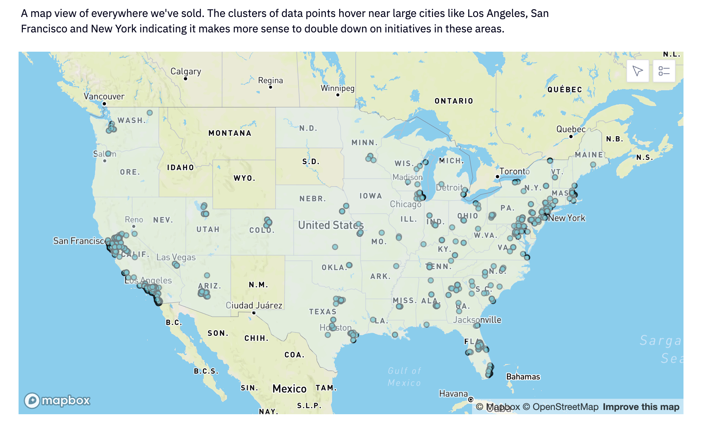
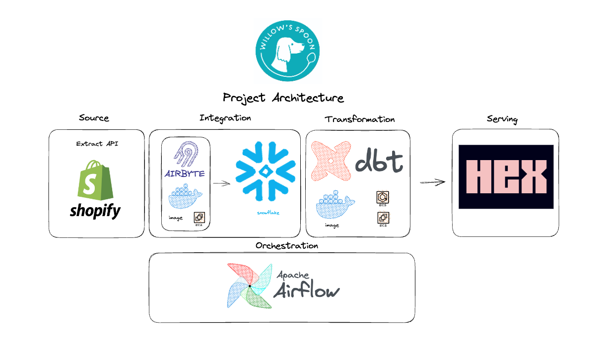

# Willow's Spoon


# Table of Contents

- [Goal](#goal)
- [Project Overview](#project-overview)
- [Architecture Diagram](#architecture-diagram)
- [Codebase](#codebase)
- [Getting Started](#getting-started)
  - [Prerequisites](#prerequisites)
  - [Building The Infrastructure](#building-the-infrastructure)
    - [AWS](#aws)
    - [Snowflake](#snowflake)
    - [Hosting Airbyte On The EC2 Instance](#hosting-airbyte-on-the-ec2-instance)
    - [Installing Octavia CLI](#installing-octavia-cli)
  - [Setting Up The DBT Project](#setting-up-the-dbt-project)
  - [Running Airflow Locally](#running-airflow-locally)
  - [Setting Up Hex](#setting-up-hex)
- [What a Workflow Might Look Like](#what-a-workflow-might-look-like)
- [What To Do As Your Business Grows](#what-to-do-as-your-business-grows)


# Goal

This project is designed to empower small businesses by unlocking the full potential of their data. Small business owners often wear many hats and juggle a variety of roles and responsibilities. It's challenging enough to understand the full picture with the data you have, let alone figuring out how to set up infrastructure or how all the pieces connect together. 

My hope is to simplify the process by providing a basic starter blueprint that's more focused on the pipeline and infrastructure rather than the reporting aspects. At the end, I'll also add some tips of key changes to make as your business grows.  


# Project Overview

During the pandemic, my partner and I launched a small business making homemade, fresh dog cookies and jerky. We were already crafting these treats for our own dogs and thought it would be a fun venture to extend this passion to a wider audience. 

This project extracts source data from the shopify API and loads it into snowflake. Once in the warehouse, DBT(Data Build Tool) transforms the raw data into facts and dimensions so it's ready for downstream use in our visualization tool (Hex). Finally, airflow calls these services on a fixed schedule.

Here is an example of a final output: Willow's Spoon nationwide sales. 



## Architecture Diagram 




## Codebase

1. **Infrastructure-core**: Terraform code of cloud resources - ec2 instance (where Airbyte is hosted), snowflake(database, schema, warehouses and grants) and airbyte(code as configuration). These resources are responsible for the extract-load portion of the pipeline. 

2. **Transformation**: DBT is used to model the data we get from Shopify (which is in 3NF) into facts and dimensions for a specific business process (sales). Additionally, the project uses a custom schema to create a separation of logic between source, staging and serving data. For our sales fact, the grain of the data is set to a unique transaction. This logic is packaged up on a docker image, uploaded on AWS ECR and then run on AWS ECS.

3. **Orchestration**: I opted to run airflow locally on a docker image. It calls airbyte and dbt as nodes in a dag. I wanted to use one of the managed services, but after seeing the cost and fresh off the pain of accidently leaving an EC2 instance on - I chose not too. 

4. **Github Actions**: An integration pipeline to automate python linting (pylint) and sql (sqlfluff for syntax rules and tests). A unique feature build into the pipeline is the configuration for branch based deployments, which runs and tests only modified sql files in their own database.


# Getting Started 

## Prerequisites

Before you begin, make sure you have the following:

1. An AWS account with appropriate permissions to create various resources.
2. A snowflake account 
3. Terraform installed on your local machine. 
4. Docker installed on your local machine. 
5. The AWS CLI installed on your local machine. 
6. Clone the repo 
7. run `pip install -r requirements.txt` in the project directory. 

## Building The Infrastructure

### AWS 
1. Navigate to the terraform directory in the cloned repository. Update the ssh config block with your own IP address or can opt to leave it open ```["0.0.0.0/0"]``` for maximum flexibility. 

2. Run terraform init to initialize the project.

3. Run terraform plan to see the changes that will be made to your infrastructure.

4. Run terraform apply to build the AWS EC2 instance. 

### Snowflake 

We need to create a separate user account from the main snowflake credentials so we can run terraform. 
1. Create an RSA key for Authentication 

```
cd ~/.ssh
openssl genrsa 2048 | openssl pkcs8 -topk8 -inform PEM -out snowflake_tf_snow_key.p8 -nocrypt
openssl rsa -in snowflake_tf_snow_key.p8 -pubout -out snowflake_tf_snow_key.pub
``` 

2. Copy the contents, starting after what followings PUBLIC KEY 

3. Paste the result from #2 into the config block below 

```
CREATE USER "tf-snow" RSA_PUBLIC_KEY='RSA_PUBLIC_KEY_HERE' DEFAULT_ROLE=PUBLIC MUST_CHANGE_PASSWORD=FALSE;
GRANT ROLE SYSADMIN TO USER "tf-snow";
GRANT ROLE SECURITYADMIN TO USER "tf-snow";
```

4. Then in a config file in your snowflake directory, run the below in a terminal session. Replace the brackets with your own snowflake account information. 

```
export SNOWFLAKE_USER="tf-snow"
export SNOWFLAKE_PRIVATE_KEY_PATH=/Users/fitz/.ssh/snowflake_tf_snow_key.p8
export SNOWFLAKE_ACCOUNT="{locator_name}"
export SNOWFLAKE_REGION="{region_name}"

```


### Hosting Airbyte On The EC2 Instance

1. Connect to the EC2 instance using SSH.

2. Install Docker on the EC2 instance, like so:

```
sudo yum update -y
sudo yum install -y docker
sudo service docker start
sudo usermod -a -G docker $USER
```

3. Install docker compose: 

```
sudo yum install -y docker-compose-plugin
docker compose version
```

4. Install Airbyte 

```
mkdir airbyte && cd airbyte
wget https://raw.githubusercontent.com/airbytehq/airbyte-platform/main/{.env,flags.yml,docker-compose.yaml}
docker compose up -d 
``` 

### Installing Octavia CLI 

1. Install Octavia to boostrap resources 

```
curl -s -o- https://raw.githubusercontent.com/airbytehq/airbyte/master/octavia-cli/install.sh | bash

```

2. Place Octavia enviornment files in your .bashrc
```
OCTAVIA_ENV_FILE=/home/ec2-user/.octavia
export OCTAVIA_ENABLE_TELEMETRY=True
alias octavia="docker run -i --rm -v \$(pwd):/home/octavia-project --network host --env-file \${OCTAVIA_ENV_FILE} --user \$(id -u):\$(id -g) airbyte/octavia-cli:0.40.18"
```

3. Configure your airbyte instance login credentials as secrets in the .octavia file 

```
OCTAVIA_ENABLE_TELEMETRY=True
AIRBYTE_USERNAME=airbyte
AIRBYTE_PASSWORD=password 
```

4. Create a separate directory to configure your source and destinations and then enter the following command 

```
octavia init
```

5. Now we need to find our custom definitions. For example: 

```
octavia list connectors sources | grep postgres 

octavia generate source decd338e-5647-4c0b-adf4-da0e75f5a750 postgres

```

This will generate the source for you. Replace all the config variables with your own account information and place secrets in your .octavia file. 

6. Congratulations! You will now see your source in the UI. 

7. Repeat above steps for destination. Just swap the word "sources" with "destination" 


## Setting Up The DBT Project

1. Install DBT with this command: `pip install dbt-snowflake` 

* Note: while we're setting up specifically for snowflake, DBT is supported by several OLAP/OLTP engines. 
Check here if you're intersted in a different configuration: https://docs.getdbt.com/docs/core/connect-data-platform/about-core-connections

2. Choose a location where you want your DBT project to reside and run `dbt init`.

3. Input your credentials in the user flow, like account, project name, role, etc. 
  - Use password for ease of use 
  - Enter the password for your snowflake account 
  - Enter the specific role you want to use that connects snowflake and DBT together
  - Choose the warehouse, the database and the schema

4. Enter `dbt debug` to verify the connection works and then congrats you're ready to start modeling!

5. Set up your dbt yaml file. I'd recommend building it in a similar structure as mine where enviornments 
are split out. This will make development and testing easier. 

6. After we're done modeling, it's time to upload an image of our project to AWS. Create a dockerfile above 
the DBT project and copy my directions (rename for your project). 

7. Build your image with `docker build -t <your_image_name:version>` 

8. Navigate to AWS and search for the ECR service and select "view push commands" and copy them. These are the commands we'll use to push our image up to AWS. 

* Note: any time we make a change to our project, we'll need to retag the image and push it up to AWS. 
* Note: if you push multiple times, make sure to delete the obsolete images to save on cost. 

9. Now we'll create the ECS service. Navigate to AWS and click on ECS. 

10. Click on create an EC2 instance Linux + Networking. 

11. Name your cluster and change your ec2 type as a t2.micro with one number of instances. Keep all the defaults for security and subnets. 

12. Create a new role, which will create an ec2 instance role and click create to build your cluster. 

13. Create a task definition and click on EC2.

14. Elect all the defaults for your task definition. 

15. For the memory and CPU elections, check out this documenation: https://aws.amazon.com/ec2/instance-types/t2/
Make sure your elections can be met by your instance. 

16. Click on add container and choose the image we made and pushed up to ECR by copying and pasting the image's URI. 

17. That's it! The good news is we only have to do the ECS part once. 


## Running Airflow Locally

1. We're running airflow locally with docker, check the dockerfile under orchestration. 

* Note: At the time of this project, snowflake and dbt had a version compatability issue, thus the workaround you see. 

2. Build the image with `docker build -t <your_image_name:version>` 

3. Create a folder locally that you want docker to map too. In my case, I've called mine "airflow". Additionally, within the folder create another folder called "dags". 

3. Run the container `docker run -p 8080:8080 -v /$(pwd):/opt/airflow <your_image_name:version>`

4. Enter in your browser `localhost:8080` to access to the airflow UI. 

5. Now we need to get our credentials from our different services. For airbyte, head over to the UI and click on the connection we previously made. In the URL, we can also see the `connection_id` after `connections`. Alternatively we can also look at the work we bootstrapped, where it would be in the connection directory. 

6. Back in airflow, navigate to `admin` and click create connection. Then, enter in the connection id and the host that the EC2 resource is running on. Finally, use port 8001 and click save. 

* Note: depending on the airbyte version you're using you may be prompted to enter in your airbyte login credentials. 

7. Now to configure our DBT service. We'll call it with the ECS operator. You will need to get the task definition and cluster from AWS. 


## Setting Up Hex 

1. Navigate to hex here: https://hex.tech/ 

2. Make an account and sign up for the free tier 

3. Navigate to "Data Sources" and input your snowflake credentials, which should be in the admin section
of your snowflake account. 

4. Once you're able to connect, that's it! You can start visualizing the queries you made with DBT! 

## What A Workflow Might Look Like 
1. During development you're testing in your development database on a separate branch. By default it's set to dev, but under the hood, anytime you run `dbt run`, it translates to `dbt run --target dev`. 

2. If the data looks as you'd expect, run `sqlfluff lint transformation/<your_project_name>` and fix any errors. 

3. Now we're ready to build our CI pipeline. On your development branch, push everything up to github and create a PR request. Then run `dbt run --target ci`. 

4. If all the checks pass, merge the branch. 

5. Push up the latest version of your code to AWS ECR. 


# What To Do As Your Business Grows 

1. Begin using DBT cloud. It simplifies overhead set up since you can call it directly as a package via Airflow. The downside though is that it costs $100 / month.  

2. Create developement versions of your resources (EC2, Airflow, etc.). As you make changes, you want to be able to test them without breaking your existing reporting pipeline. Different versions. 

3. Use a managed provider for orchestration. Typically, we an orchestrated hosted in the cloud. This greatly simplifies the process, which means less manual overhead. The tradeoff though is cost; at around $0.50 / minute, it's one of the most expensive cloud resources there is, which is why we didn't start there. 