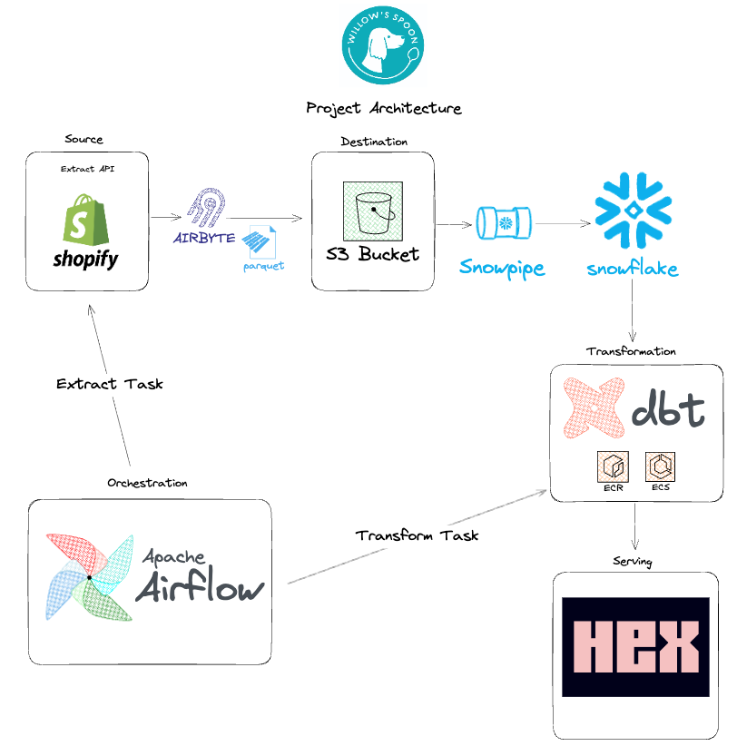

# Willow's Spoon


# Table of Contents

- [Goal](#goal)
- [Project Overview: Automated Pipeline for Shopify Data](#project-overview-automated-pipeline-for-shopify-data)
- [Architecture Diagram](#architecture-diagram)
- [Codebase](#codebase)
- [Getting Started](#getting-started)
  - [Prerequisites](#prerequisites)
  - [Building The Infrastructure](#building-the-infrastructure)
    - [AWS](#aws)
    - [Snowflake](#snowflake)
    - [Hosting Airbyte](#hosting-airbyte)
  - [DBT Setup](#dbt-setup)
  - [Setting Up Hex](#setting-up-hex)
- [Future Considerations](#future-considerations)


# Goal
This project is designed to help empower small businesses by unlocking the full potential of their data. My hope is that others can use this as a template to plug and play with as their business scales. 


# Project Overview: Automated Pipeline for Shopify Data

This project establishes an automated data pipeline that efficiently processes data from Shopify and prepares it for downstream consumption.

1. **Data Extraction**: I utilized Airbyte hosted on an EC2 instance, where data is extracted from Shopify. The configuration (source, destination and connection) is managed through the Octavia CLI. Each data stream is incremental and deduped. 

2. **Data Storage**: The extracted data is saved as Parquet files and sent to an AWS S3 bucket.

3. **Data Ingestion and Transformation**:
   - **Snowpipe**: Automatically ingests new data from the S3 bucket into Snowflake.
   - **DBT in Snowflake**: Transforms the raw data into facts and dimensions, optimizing it for reporting purposes. 

4. **Orchestration**: AWS Managed Airflow orchestrates the workflow on a fixed daily schedule. 


## Architecture Diagram 




## Codebase

### Infrastructure 

- **AWS**:
  - **EC2 (`./aws/ec2/`)**: Hosts the Airbyte instance for data extraction from Shopify.
  - **ECS (`./aws/ecs/`)**: Manages container orchestration and container specs. 
  - **ECR (`./aws/ecr/`)**: Handles the repo registry and repo specs.
  - **MWAA (`./aws/mwaa/`)**: Orchestrates the data pipeline workflows, managing DAGs and dependencies.
  - **S3 (`./aws/s3/`)**: Configures S3 buckets for data storage and integration with Snowpipe for data ingestion.
- **Airbyte (`./airbyte/`)**: Manages data extraction configurations, including connections, sources, and destinations, through Octavia CLI.
- **Snowflake (`./snowflake/`)**: Sets up Snowflake infrastructure, including databases, schemas, warehouses, and grants.

### Transformation


2. **Transformation**: DBT is used to model the data from 3NF into facts and dimensions for a specific business process (sales). Additionally, the project has customized databases and schemas to create a logical separation between source, staging and serving data. For our sales fact, the grain of the data is set to a unique transaction. 

### 3. Github Actions

Automates various checks and deployment tasks for the project, enhancing efficiency and ensuring code quality. Key features include:

- **Linting**:
  - Enables sql and python linting to ensure consistency and quality. 

- **Branch-Based Deployments**: 
  - The pipeline is triggered on pull requests to the main branch, allowing for branch-specific testing and deployment.
  
- **Selective Model Testing**: 
  - Tests only the models that have changed, as compared to the production manifest. This approach optimizes the testing process by focusing on modified areas only.

- **Image Building and Deployment**: 
  - Builds a new Docker image, deploys it to AWS ECR (Elastic Container Registry), and forces a new deployment to AWS ECS (Elastic Container Service). 


Here is an example of a final output: Willow's Spoon all time nationwide sales. 


# Getting Started 

## Prerequisites

Before you begin, make sure you have the following:

1. An AWS account with appropriate permissions to create various resources.
2. A snowflake account 
3. Terraform installed on your local machine. 
4. Docker installed on your local machine. 
5. The AWS CLI installed on your local machine. 
6. Clone the repo 
7. run `pip install -r requirements.txt` in the project directory. 

## Building The Infrastructure

### AWS 
1. Within the AWS subfolder, there are a number of AWS resources with their own sub folders. Navigate to any one of those folders. 

2. In the provider block, update the profile to your own. You can find it locally within `.aws` 

2. Each resource uses an s3 bucket and a dynamo db table as the backend to track state. You will first need to replace this backend with a local one. So within each `main.tf`: 

```
  backend "s3" {
    bucket         = "ecr-tf-state-001"
    key            = "tf-infra/terraform.tfstate"
    region         = "us-east-2"
    dynamodb_table = "ecr-terraform-state-locking"
    encrypt        = true
  }

```

update on first creation to:

```
  backend "local" {
    path = "terraform.tfstate"

  }

```
3. Run `terraform plan` to see the resources that will be built in your AWS account and then run `terraform apply` to create those changes. 

4. Then swap your backend from local to s3 and recopy the configurations. Now that those resources are built, we can use them. Run `terraform init migrate-state` to convert your backend. 

5. Repeat steps above for each AWS resource. 


### Snowflake 

We need to create a separate user account from the main snowflake credentials so we can run terraform. 

Follow the instructions here: https://quickstarts.snowflake.com/guide/terraforming_snowflake/index.html#2 


### Hosting Airbyte

Since we've created our EC2 instance earlier, we can get set up with Airbyte. For that follow the directions here: 

https://docs.airbyte.com/deploying-airbyte/on-aws-ec2

We'd also like to version control our configurations within airbyte. To do that, follow the instructions here: 

https://airbyte.com/tutorials/version-control-airbyte-configurationshttps://airbyte.com/tutorials/version-control-airbyte-configurations


## DBT Setup

1. Choose a location where you want your DBT project to reside and run `dbt init`.

3. Input your credentials in the user flow, like account, project name, role, etc. 
  - Use password for ease of use 
  - Enter the password for your snowflake account 
  - Enter the specific role you want to use that connects snowflake and DBT together
  - Choose the warehouse, the database and the schema

4. Enter `dbt debug` to verify the connection works and then congrats you're ready to start modeling!

5. Set up your DBT profile and yaml to mirror mine that way the automations in the github actions workflow will work as expected. 


## Setting Up Hex 

1. Navigate to hex here: https://hex.tech/ 

2. Make an account and sign up for the free tier 

3. Navigate to "Data Sources" and input your snowflake credentials, which should be in the admin section
of your snowflake account. 

4. Once you're able to connect, that's it! You can start visualizing the queries you made with DBT! 


# Future Considerations
1. Cloud resources are expensive, particularly managed airflow, which costs $0.50 / minute. It's important to determine if this kind of outflow or just hosting things in the cloud in general is worth it for your specific use case. AWS has an expense projection tool to play around with here: https://calculator.aws/#/ 

2. A best practice would be to have separate development and production pipelines. I've designed this in a way where adding a production node would be pretty easy. First duplicate the ECS and MWAA resources for production pipeline. In the docker image, you could add a line for an additional arguement like dev or prod and have your container look for it as an arguement. Finally, in github actions since you'd be using the same image, you would just update a prod version of ECS. I didn't do this myself, because it was too expensive to play around with. 

3. It would be nice to be able to visualize our DBT project that shows the logical relationships between the models we created, meaning we'd have to host it somehwere. Of course, you could solve this by just using dbt-cloud...but that's not as fun, when we could just figure out how to build it. Additionally, we'd need to have our github actions able to detect changes within the dbt project so it could update the documentation. 

4. For the sake of simplicity to just get started, I was purposely pretty lax about the security requirements. Realistically we could be adding more there, like security groups that restrict by IP addresses that allow you access to certain resources. 

5. I noticed recently that an Airbyte terraform provider finally came out. It makes sense to update the Octavia CLI stuff to Airbyte, since we've already used terraform extensively and more people are familiar with terraform. 

6. If you have high velocity in your data, it makes sense to add a lifecycle configuration block for your s3 bucket. The idea here is that data is already being replicated downstream, so you don't need essentially two copies of it and because it can become very expensive otherwise. 
